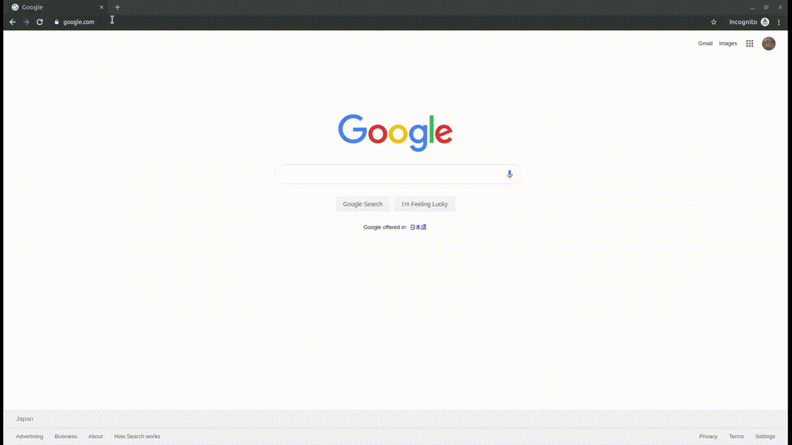

# alva

A simple CRUD app in React/Redux/Typescript/Rails/Auth0  
(Deployed on Heroku: https://si0005hp-alva.herokuapp.com )



## Setup

### Prerequisites

You need to activate **Auth0** account and configure [spa/React](https://auth0.com/docs/quickstart/spa/react) as the app requires it.

### dev

`$ foreman start -f Procfile.dev`

### production build

`$ yarn postinstall && rails s -p 5000`

### deploy to heroku

1. Create app

`$ heroku create <HEROKU_APP_NAME>`

2. Set env vars

```
$ heroku config:set \
  AUTH0_CLIENT_ID=<YOUR_CLIENT_ID> \
  AUTH0_JWKS=https://<YOUR_TENANT_NAME>.auth0.com/.well-known/jwks.json \
  REACT_APP_AUTH0_CLIENTID=<YOUR_CLIENT_ID> \
  REACT_APP_AUTH0_DOMAIN=<YOUR_TENANT_NAME>.auth0.com
```

3. Add nodejs buildpack

`$ heroku buildpacks:add --index 1 heroku/nodejs`

4. Deploy app

`$ git push heroku master`

5. migrate DB

`$ heroku run rails db:migrate`

6. Allow Web Origins and Callback URLs on Auth0 settings

Configure above on [heroku dashboard](https://manage.auth0.com/dashboard).
